# Exploring materials with PySCF: Electronic Structures and Optical Properties 

## Final Project, Computational Physics, Fall 2024

_Yichen Guo_, _Xiaohui Liu_, _Xinyue Peng_


## Introduction 

Scientists have long sought to solve the quantum mechanical many-electron Schrödinger equation to elucidate electronic structures and predict the properties of molecules and materials.

Solving this equation for real systems is an extremely challenging task due to the complex interactions between electrons. The exact solution is computationally infeasible for systems with more than a few particles, making approximate methods like **Hartree-Fock Self-Consistent Field** (HF-SCF) and **Kohn-Sham Density Functional Theory** (KS-DFT) indispensable.

HF-SCF and KS-DFT are two foundational methods in quantum chemistry and condensed matter physics with fundamentally different approximations and frameworks.

### Hartree-Fock Self-Consistent Field (HF-SCF)
The HF-SCF method provides an approximate solution to the many-electron problem by representing the ground state wavefunction as a single Slater determinant $$\Psi_0$$ constructed from molecular orbitals $$\psi_0$$
```math
\Psi_0 = A|\psi_1(1)\psi_2(2)...\psi_N(N)|
```
Then the ground state energy could be represented as
```math
E = \braket{\Psi_0| \hat{H} | \Psi_0}
```
The minimization of the total energy leads to a self-consistent equation

$$\mathbf{FC} = \mathbf{SCE}$$

Here C is the matrix of molecular orbital coefficients, E is a diagonal matrix of the corresponding eigenenergies, and S is the atomic orbital overlap matrix. The Fock matrix F could be defined as 

$$\mathbf{F} = \mathbf{T}+\mathbf{V}+\mathbf{J}+\mathbf{K}$$

where $\mathbf{T}$ is the kinetic energy matrix, $\mathbf{V}$ is the external potential, $\mathbf{J}$ is the Coulomb matrix, and $\mathbf{K}$ is the exchange matrix.

HF-SCF simplifies the complex many-body interactions by treating the repulsion between electrons in an average sense, leading to a mean-field description of electron-electron interactions.

### Kohn-Sham Density Functional Theory (KS-DFT)
KS-DFT is a more contemporary and widely used approach based on the Hohenberg-Kohn theorems and the Kohn-Sham formalism. It uses the same formulation as HF-SCF and calculates the same self-consistent equation, but replaces the Fock matrix with a different Fock potential

```math
\mathbf{F} = \mathbf{T}+\mathbf{V}+\mathbf{J}+\mathbf{E_{xc}}
```

Where $\mathbf{E_{xc}}$ is the exchange-correlation(xc) energy and is approximated by a density functional approximation, based on different structures and interactions in different systems, there are many different density functional approximations. For example, local density approximation (LDA) depends only on the electron density $\rho$, and generalized gradient approximation (GGA) depends on both electron density $\rho$ and the density gradient $|\nabla\rho|$.

## Installation

## Example: Raman spectroscopy for Glycine
Raman spectroscopy is a common technique used in chemistry and biology to study chemical composition of the sample. Due to the fact of low background to noise ratio in the real life experiment, getting good quality Raman spectrum requires careful set up. Thus, simulating the Raman spectrum for biological molecule could be useful for calibrating experimental apparatus and cross check experimental result etc.

In order to simulate Raman spectrum, we first get the equilibrium structure from geometric optimization for the molecule. Then from there we can get the vibrational frequencies and modes from the Hessian matrix which tells you where the spectrum peaks should be. At the end, Raman intensity can be derived from looking at the change in the polarizability respect to the vibrational modes.
Here are some examples of the results: H2O and Glycine conformer

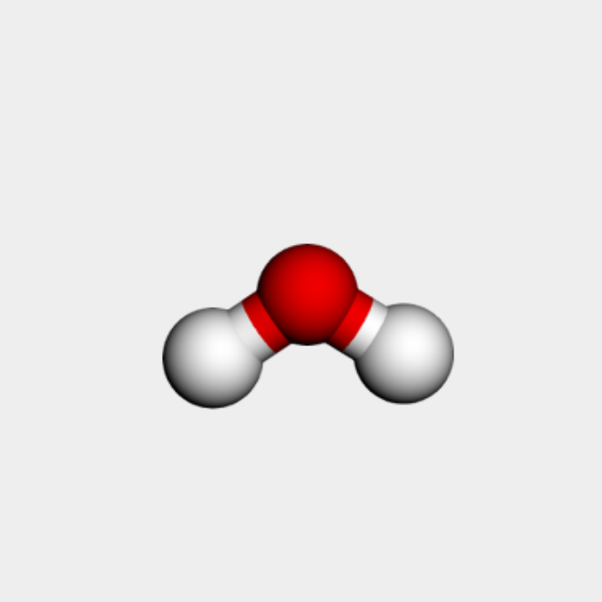


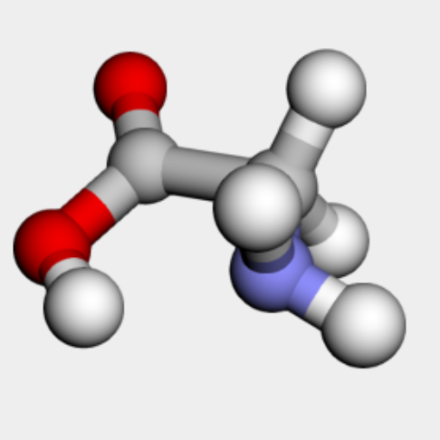

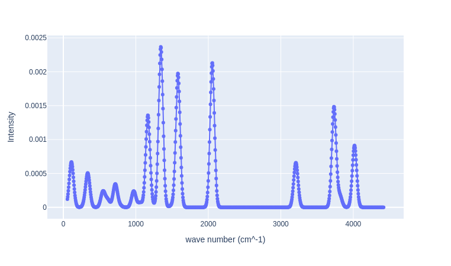

## Example: DFT calculation of Graphene

To calculate the ground state energy and electronic and optical properties, the following steps could be adopted.

### Step 1: Define the graphene structure 
We could use PySCF or an external package ASE to generate a graphene lattice and convert it to a PySCF cell
```
import pyscf.pbc.tools.pyscf_ase as pyscf_ase
from ase.build import graphene

a = 2.46  # Lattice constant in Å
graphene_cell = graphene(formula="C2", a=a, size=(1, 1, 1), vacuum=10)
print("Graphene volume:", graphene_cell.get_volume())

# Step 2: Convert to PySCF Cell
cell = pbcgto.Cell()
cell.atom = pyscf_ase.ase_atoms_to_pyscf(graphene_cell)
cell.a = graphene_cell.cell  # Lattice vectors
cell.basis = 'gth-szv'
cell.pseudo = 'gth-pade'
cell.verbose = 5
cell.build(None, None)

# Visualize the material structure
view(cell)
return pyscf_cell
```
The graphene cell would be output

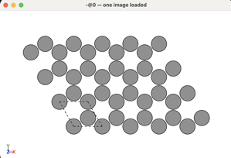

### Step 2: Set the ideal basis set and pseudopotential
We then need to set the basis set and the pseudopotential for the system, or use the interactive widget to tune these parameters interactively. Details see './code/Graphene_interactive_interface.ipynb'

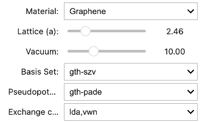

### Step 3: Perform SCF and band structure calculation

```
import pyscf.pbc.dft as pbcdft

mf = pbcdft.RKS(cell)
mf.xc = xc
energy = mf.kernel()
print(f"Total Energy: {energy:.6f} ")
```
This would give the ground state energy, and then we could define the k-space and calculate the band structure.

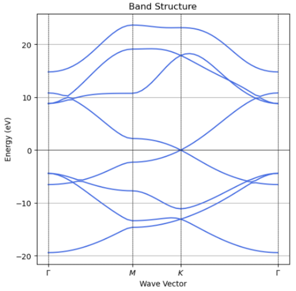

### Step 4: Calculate the Absorption spectrum

With the given ground states and ground state energy, we could then obtain the absorption spectrum of the system by summing over all possible transition energy at all k points.

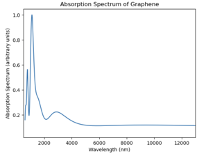
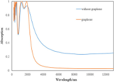

We can see the calculated absorption spectrum only partially captures graphene's real absorption spectrum. This could come from the fact that actual absorption comes with an external field interacting with graphene and the system moves to an excited state. It might require using time-dependent DFT to capture all the features.

## Example: Strain-induced effect in band structures and DOS ...

Studying strained graphene is crucial because strain alters its electronic, mechanical, and optical properties, enabling a wide range of applications and discoveries. Key reasons include:
1.	Tuning Properties: Strain can modify graphene’s band structure, potentially opening a bandgap for semiconductors or shifting Fermi points for better electronic transport.
2.	Novel Physics: It induces pseudomagnetic fields and mimics curved spacetime, providing insights into quantum and relativistic phenomena.
3.	Enhanced Applications: Strained graphene is ideal for flexible electronics, strain sensors, and optoelectronics due to its sensitivity to deformations.
4.	Straintronics and Moiré Effects: Strain enables new devices in straintronics and enhances phenomena in stacked 2D materials, like superconductivity or correlated electronic states.
   
This research advances fundamental physics and innovative applications in technology.

### Experimental Example: Nanostructure-Induced Strained Graphene

An experimental setup demonstrates how strain, induced by nanostructures, affects graphene’s optical signals. The accompanying images show graphene's lattice stretched along one direction, with noticeable changes in its structure and properties.

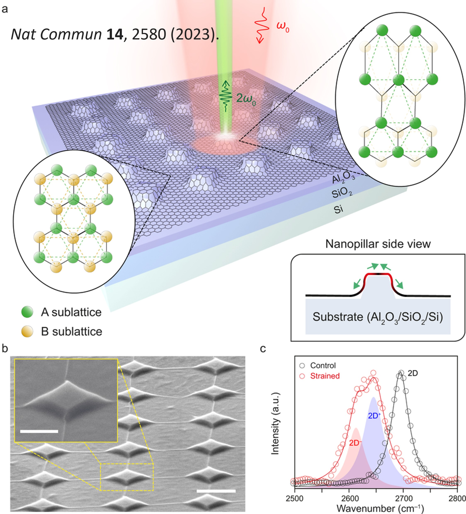

When graphene is stretched in one direction, it contracts in the perpendicular direction due to its Poisson’s ratio. This deformation shifts the Fermi points and causes the energy cone to move away from the original K point in momentum space.

### Simplifying the Problem

To analyze the effects of strain, deformation is simplified into two perpendicular directions, Zigzag and Armchair. For a clearer focus, calculations are performed for one direction at a time using Density Functional Theory (DFT). The results for normal monolayer graphene, including its Density of States (DOS), match well at the K point, ensuring reliability for subsequent strained calculations.

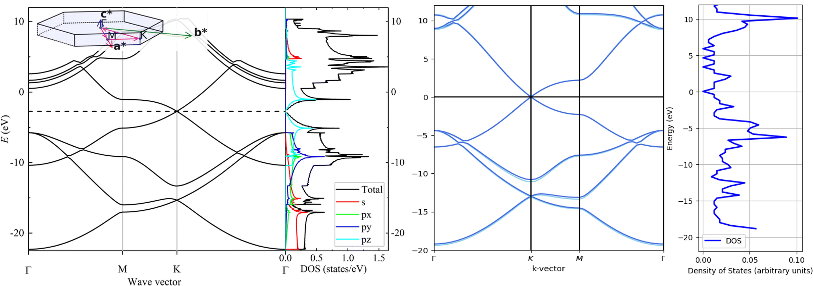

### Strain Along the Armchair Axis

By applying 0.5%-3.5% strain along the Armchair axis, the graphene lattice stretches proportionally. The strain is incorporated into the graphene lattice parameters using the ASE package. This process enables visualization of the lattice changes.

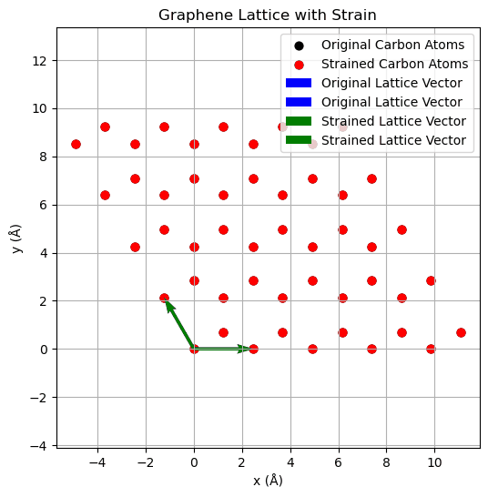

### Bandgap Opening

As strain increases, a bandgap opens at the K point, with the conduction and valence bands no longer meeting at their original positions. The gap size increases linearly with strain, consistent with previous research findings.

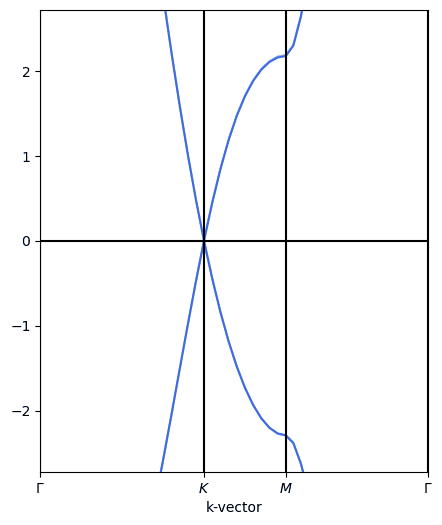

### Key Observations

Strain-induced bandgap opening: A linear dependency is observed between strain magnitude and the bandgap size.
Visualization and computation: Strain effects are modeled and visualized, enabling deeper insights into strained graphene's properties.
This study demonstrates how strain engineering can effectively modify graphene’s electronic properties, paving the way for advanced applications and deeper understanding of 2D material behavior.

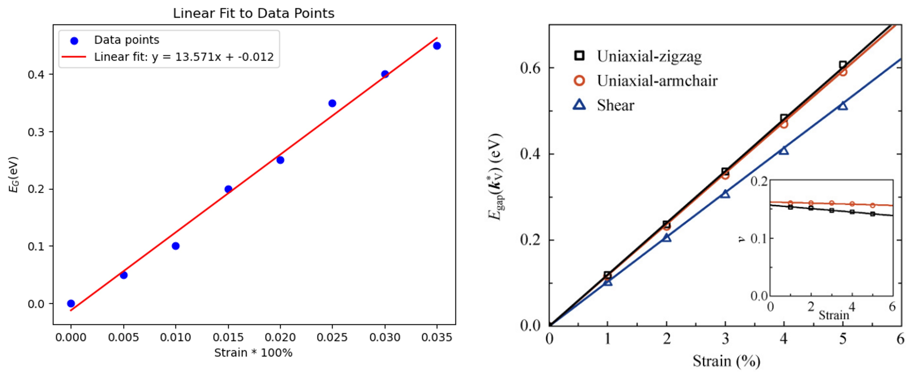


## Resources

[PySCF](https://pyscf.org/index.html)
[ASE](https://wiki.fysik.dtu.dk/ase/index.html)
